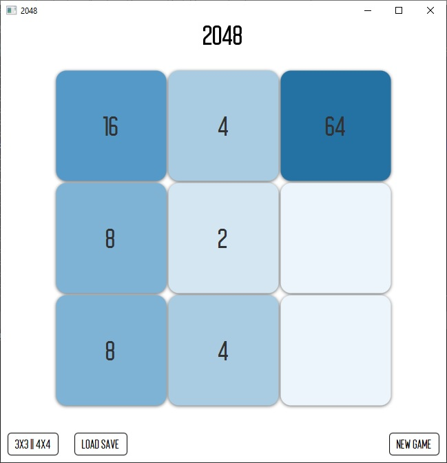

# JavaFX2048Game
2048 game.

## General info
The game is played with a computer. Algorithm is responsible for adding new tiles.

## How to play 
Use your arrow keys to move the tiles. When two tiles with the same number touch, they merge into one.

## Installation
Clone this repo to your local machine using [https://github.com/PawelM-code/JavaFX2048Game.git](https://github.com/PawelM-code/JavaFX2048Game.git)

## Screenshot
### 3x3

### 4x4

## Technologies
Project is created with:
* Java jdk 8
